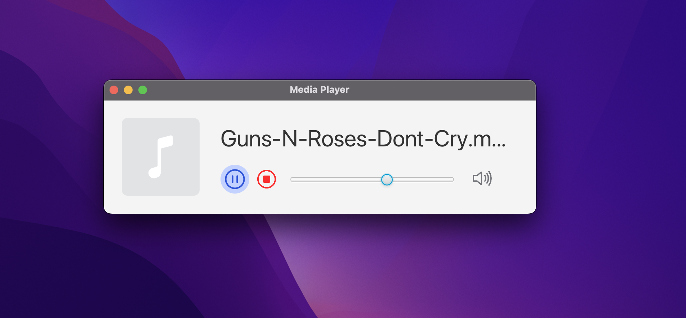

<h1 align="center">
  Media Player JavaFX
</h1>
 

  

  <a href="#-tecnologias">Tecnologias</a>&nbsp;&nbsp;&nbsp;|&nbsp;&nbsp;&nbsp;
  <a href="#-projeto">Projeto</a>&nbsp;&nbsp;&nbsp;

  

## 💬 Descrição
Um simples media play feito com JavaFX para um exercício da faculdade. 

## 🚀 Tecnologias

Esse projeto foi desenvolvido com as seguintes tecnologias:

- JAVA
- JAVAFX

## 🎨 Inspiração:

Figma: https://www.figma.com/proto/ulHuE5TmVdqHdgQtDhpVrQ/MP3Player---Java-Layout?page-id=0%3A1&node-id=3%3A5&viewport=241%2C48%2C0.59&scaling=min-zoom

---

Feito com ♥ by edson-dantass